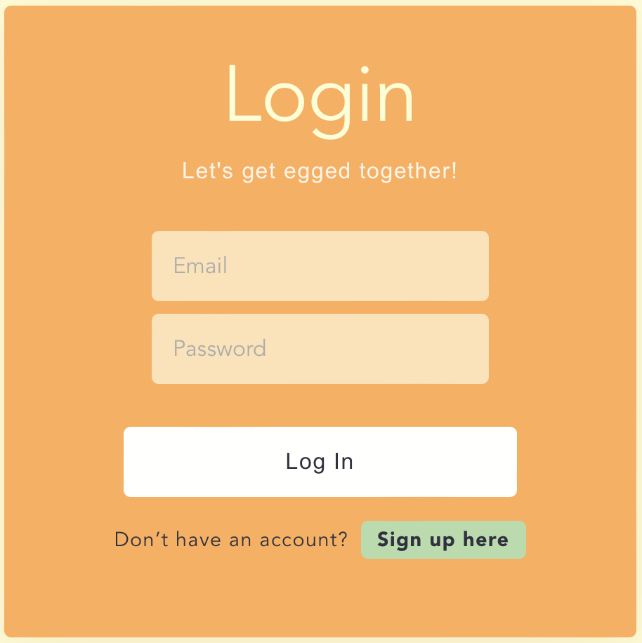
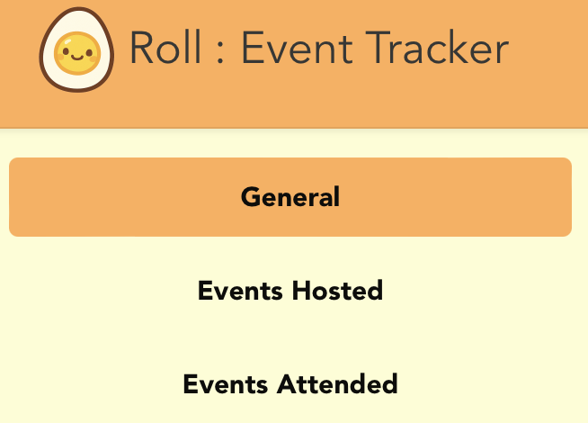
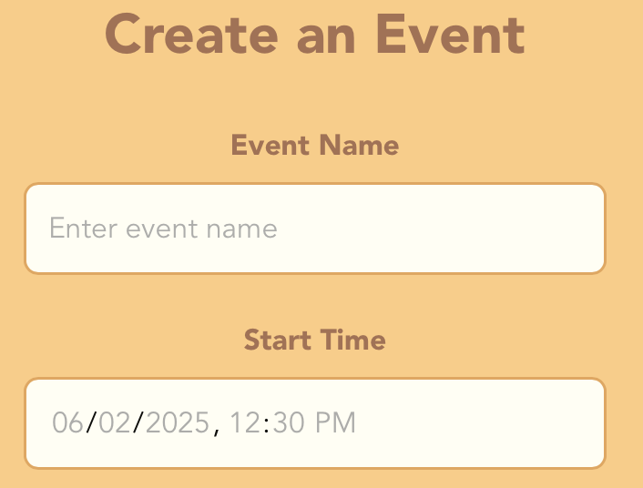
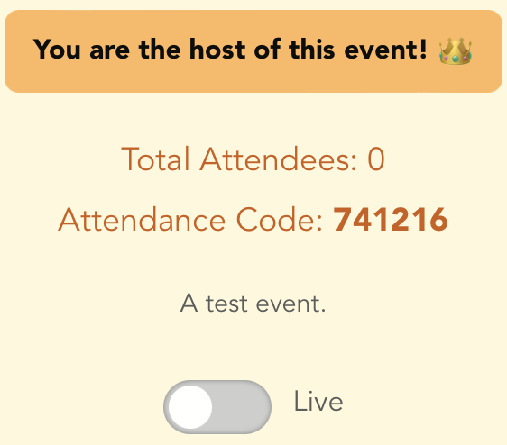
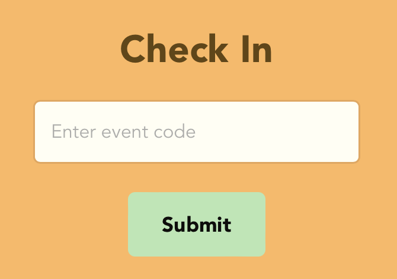
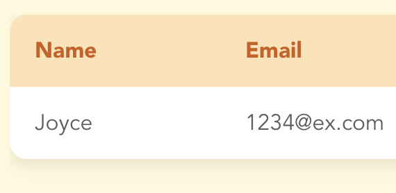
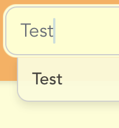

<p align="left">
  
</p>

# About EggRoll

EggRoll is a web app that lets users create and manage attendance events! Logged-in users can create events with a name and start time, and each event generates a unique attendance code. Attendees can submit this code to mark their attendance while the event is live.
Explore unique features such as:
- Toggle events between live/dead status to control when attendees can attend your event!
- Three unique views which organize your events
- Attendance Dashboard that changes based on your identity!

See our [Presentation Slides](https://docs.google.com/presentation/d/1jMU-ggGSLUYi3tL-4mMITBsmMLiqeY3Cy5ydBas7mSg/edit?usp=sharing).

# How to Run

Run the following command in the terminal from the directory you wish to clone this repository.
```
git clone https://github.com/Jessicaus/eggroll.git
cd eggroll
npm install
```
To start up the server, run `npm run dev` in the same directory. Go to http://localhost:5173/ to view the app in your browser.

If you have a tarball (`.tgz` or `.tar.gz`), unzip the tarball and go into the folder, the eggroll directory. In the folder, run
```
npm install
npm run dev
```
Then go to http://localhost:5173/ to view the app in your browser.

# Tech Stack

This app was created using the following technologies:

<table width="100%">
  <tr>
    <td align="left" width="33%">
      <br/>
      <p align="center"><small>React + Vite (Frontend)</small></p>
    </td>
    <td align="center" width="34%">
      <br/>
      <p align="center"><small>Node.js (Backend)</small></p>
    </td>
    <td align="right" width="33%">
      <br/>
      <p align="center"><small>Supabase (Database)</small></p>
    </td>
  </tr>
</table>

# App Features

Here are some of the main features this app supports:

<p align="left">
  <small><strong>Register/Login</strong></small><br/>
  
</p>

<p align="left">
  <small><strong>Switch Views</strong></small><br/>
  
</p>

<p align="left">
  <small><strong>Create Events</strong></small><br/>
  
</p>

<p align="left">
  <small><strong>Toggle Event Status</strong></small><br/>
  
</p>

<p align="left">
  <small><strong>Check Into Events</strong></small><br/>
  
</p>

<p align="left">
  <small><strong>Live Attendance Dashboard</strong></small><br/>
  
</p>

<p align="left">
  <small><strong>Search Events</strong></small><br/>
  
</p>
